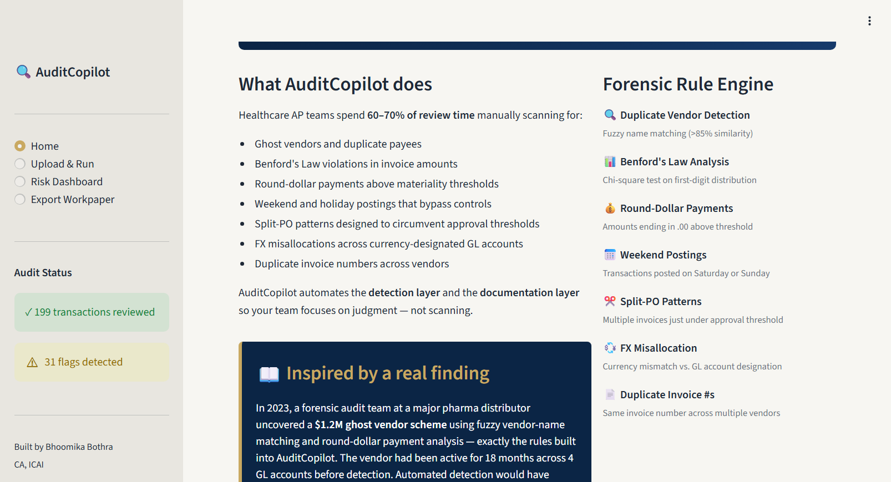
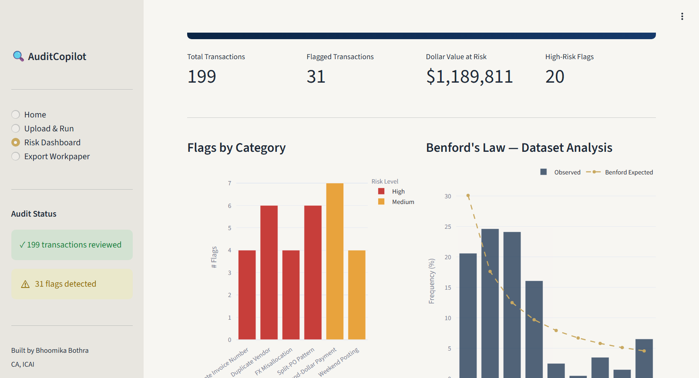
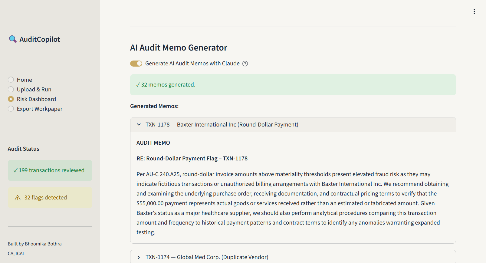
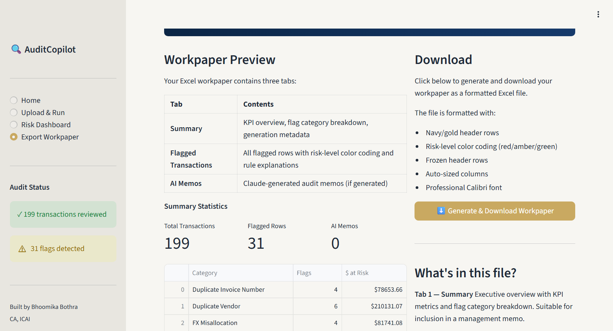

# AuditCopilot 🔍

**AI-assisted forensic AP review for healthcare finance teams.**

AuditCopilot ingests accounts payable transaction data, runs a forensic accounting rule engine to flag anomalies, and generates auditor-ready workpaper memos using Claude, citing AU-C 240 (fraud), AU-C 315 (risk assessment), and IAS 21 (FX) standards.

> Built by **Bhoomika Bothra**. CA Finalist (ICAI, Group 1 cleared), MS Accounting and Analytics (Seattle University), CPA Candidate.

📂 **Application source code:** [`artifacts/audit-copilot/`](./artifacts/audit-copilot)

---

## The story behind this project

In a previous Group Financial Accountant role at a multinational pharma distributor, I uncovered a **$1.2M ghost vendor scheme** through manual reconciliation, and a **$180K FX misallocation** under IAS 21. Both reviews took weeks of manual work.

AuditCopilot is the AI-assisted version of that workflow. On 199 synthetic healthcare AP transactions with planted anomalies, it:

- Reviews 100% of the population in seconds (vs. statistical sampling)
- Identifies **$1.22M of risk-flagged value** across 32 flagged transactions
- Generates **32 workpaper-ready audit memos** citing the relevant standards
- Exports a 3-tab Excel workpaper ready for senior reviewer sign-off

---

## Screenshots

### Home — what AuditCopilot does


### Risk Dashboard — 199 transactions, 32 flags, $1.22M at risk


### AI-generated audit memo — citing AU-C 240, written by Claude


### Excel workpaper export


---

## What it detects

| Rule | What it catches | Standard |
|---|---|---|
| **Duplicate Vendor (Fuzzy Match)** | Ghost vendors via name similarity (e.g. `MedSupply Inc` vs `Med Supply Inc.`) | AU-C 240.A25 |
| **Round-Dollar Payments** | Unusual round amounts above materiality | AU-C 240.A32 |
| **Weekend / Holiday Postings** | Transactions outside normal business hours | AU-C 315 |
| **Split-PO Patterns** | Multiple invoices just under approval threshold | AU-C 240 |
| **FX Misallocation** | USD invoices posted to EUR-designated GL accounts | IAS 21 |
| **Duplicate Invoice Numbers** | Same invoice number across vendors | AU-C 240 |
| **Benford's Law Analysis** | Dataset-level first-digit distribution test | Forensic accounting |

---

## Tech Stack

- **Python 3.11**, **Streamlit** — web framework
- **pandas, numpy, scipy, rapidfuzz** — data + forensic rules
- **plotly** — interactive charts
- **openpyxl** — Excel workpaper export
- **Anthropic Claude API** (`claude-sonnet-4-5`) — audit memo generation

---

## How it works

1. Upload an AP CSV (or use the built-in 199-row synthetic dataset)
2. The forensic rule engine flags anomalies across 7 categories
3. Risk Dashboard surfaces KPIs, flag counts, dollar exposure, and a sortable transaction table with red/amber/green risk badges
4. Toggle "Generate AI Memos" → Claude drafts audit memos citing the relevant standard and recommending a specific testing procedure for each flag
5. Export a 3-tab Excel workpaper (Summary, Flagged Transactions, AI Memos) ready for senior reviewer sign-off

---

## Run it locally

```bash
git clone https://github.com/bhoomika122/auditcopilot.git
cd auditcopilot/artifacts/audit-copilot
pip install -r requirements.txt
export ANTHROPIC_API_KEY=sk-ant-...   # optional, for AI memos
streamlit run main.py
```

App runs at `http://localhost:8501`. Without an API key, the rule engine still works — only the AI memo step is disabled.

---

## What this project demonstrates

- **Forensic accounting domain expertise** — rules cite the standards a senior auditor would reach for in the field
- **AI integration that adds judgment, not just text** — memos recommend procedures, not generic disclaimers
- **End-to-end deliverable thinking** — UI, rule engine, AI layer, and downloadable workpaper, all in one application
- **Healthcare AP context** — McKesson, Cardinal Health, AmerisourceBergen, Henry Schein, Medline, Becton Dickinson, and Stryker as a realistic vendor universe

---

## Repository structure
